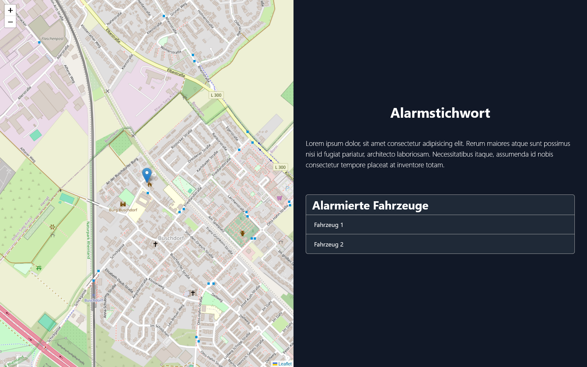

# Alarmmonitor

The alarm monitor is a type of dashboard that displays alarm data clearly. The application relies on React and receives data via a websocket connection.

To build the application, [pnpm](https://pnpm.io/) can be used. Using the command `pnpm run build`, the code is packed into a Javascript file via [vite](https://vitejs.dev/) and can be delivered via a web server.

The pipeline in this repository builds the project and deploys it as a container in the Kubernetes cluster. The repository is developed on a GitLab and only mirrored on GitHub. Internal services are used, the pipeline and also various containers from a private registry would have to be adapted.